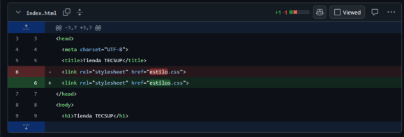
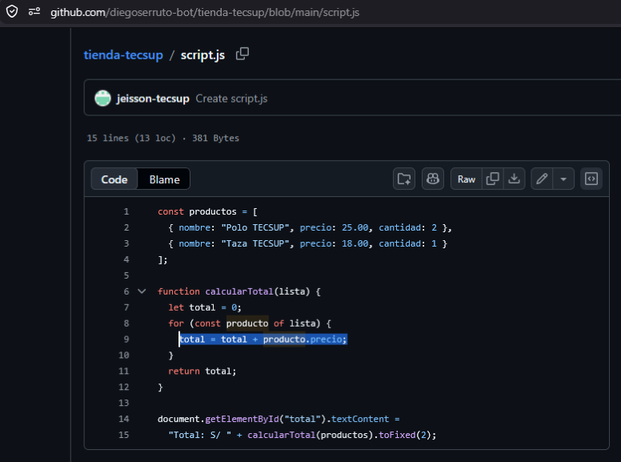

# Guía del proyecto Tienda Tecsup

## Descripción

En este proyecto se desarrolló un ejercicio en el que se colocaron intencionalmente dos errores en el código: uno en CSS y otro en JavaScript. El objetivo fue identificar y corregir estos errores utilizando Git y GitHub, para posteriormente incorporar las correcciones a la rama **main**.

## Proceso realizado

1. Se clonó el repositorio del proyecto para trabajar de manera local.
2. Se revisó el funcionamiento de la tienda y se identificaron los errores existentes.
3. Se creó una rama para realizar la primera corrección.
4. Se revisó el archivo **script.js** y se encontró un error en el cálculo del total del carrito.
5. Se corrigió el cálculo para que el precio del producto se multiplique por la cantidad seleccionada.
6. Se realizó un commit con la corrección y se subió la rama al repositorio remoto.
7. Se creó un Pull Request para incorporar la primera corrección a **main**.
8. Se revisó nuevamente el proyecto para identificar el segundo error.
9. Se encontró un problema en **index.html** relacionado con la _referencia al archivo_ **estilos.css**, por lo que los estilos no se aplicaban correctamente.
10. Se corrigió la referencia al archivo CSS.
11. Se realizó un segundo commit y se subió la nueva rama al repositorio remoto.
12. Se creó un segundo Pull Request para incorporar la corrección a **main**.
13. Finalmente, se verificó que ambas correcciones funcionaran correctamente en el proyecto.

## Archivos principales

### index.html

Contiene la estructura principal de la página de la tienda y las referencias a los archivos CSS y JavaScript.

### estilos.css

Contiene los estilos visuales de la página.

El error estaba relacionado con la referencia realizada desde index.html, por lo que los estilos de la página no se mostraban correctamente. Se corrigió la referencia para que el archivo CSS pudiera cargarse.



### script.js

Contiene la lógica del carrito de compras.

El error se encontraba en el cálculo del total. El código sumaba solamente el precio del producto y no consideraba la cantidad seleccionada.

La corrección consistió en multiplicar el precio por la cantidad:



`total = total + producto.precio * producto.cantidad;`

## Comandos utilizados en la terminal de VS

| Comando    | Función                                     |
| ---------- | ------------------------------------------- |
| git clone  | Clona el repositorio en el equipo           |
| git branch | Permite revisar las ramas existentes        |
| git status | Muestra el estado actual del repositorio    |
| git add    | Prepara los cambios para realizar un commit |
| git commit | Guarda los cambios realizados               |
| git push   | Sube los cambios al repositorio remoto      |

Para revisar los cambios antes de realizar un commit se puede utilizar git status.

```bash
git status
git add .
git commit -m "Corrige el error del proyecto"
git push origin nombre-rama
```

## Trabajo realizado en GitHub

Durante el desarrollo se utilizaron Issues y Pull Requests para organizar las correcciones.

- [Issue 1: Error en el cálculo del carrito](https://github.com/jeisson-tecsup/tienda-tecsup/issues/253)
- [Pull Request 1: Corrección del carrito](https://github.com/jeisson-tecsup/tienda-tecsup/pull/283)
- [Issue 2: Error en los estilos](https://github.com/jeisson-tecsup/tienda-tecsup/issues/301)
- [Pull Request 2: Corrección de los estilos](https://github.com/jeisson-tecsup/tienda-tecsup/pull/305)
- [Repositorio Tienda Tecsup](https://github.com/diegoserruto-bot/tienda-tecsup)

## Comprobación

- [x] Se corrigió el error de JavaScript.
- [x] Se corrigió el error de CSS.
- [x] Las correcciones fueron incorporadas a main.
